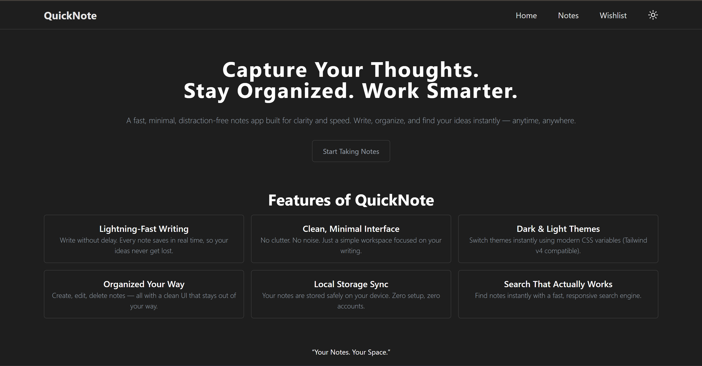
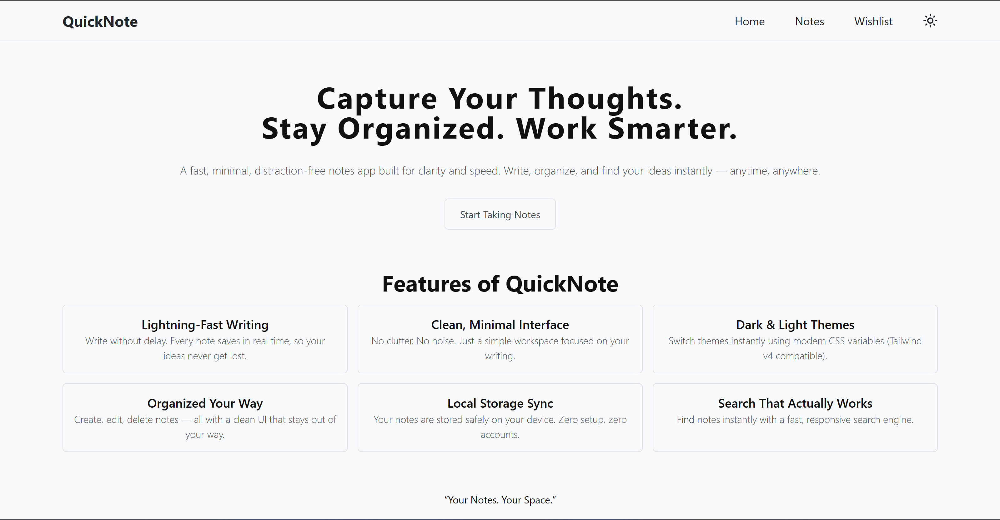

# QuickNote - Modern Note-Taking Application

QuickNote is a feature-rich note-taking application built with React and Vite, designed to help you capture, organize, and manage your thoughts effortlessly. With a sleek interface and powerful features, it provides a seamless experience for both personal and professional note management.

## ✨ Features

### Core Functionality

- **Create Notes**: Easily create notes with titles and detailed content
- **Edit & Update**: Modify existing notes with a single click
- **Delete Notes**: Remove notes you no longer need
- **Wishlist Management**: Mark important notes and add them to your wishlist for quick access
- **Persistent Storage**: All notes are automatically saved to localStorage, ensuring your data persists across sessions

### User Experience

- **Dark & Light Mode**: Switch between themes for comfortable viewing in any environment
- **Clean Interface**: Minimalist design that keeps you focused on your notes
- **Real-time Updates**: Instant feedback as you create, edit, or delete notes
- **Smooth Scrolling**: Dedicated scrollable area for your notes collection
- **No Notes Placeholder**: Clear messaging when your notes list is empty
- **📱 Mobile-responsive design**: for seamless experience across all devices

## 📸 Screenshots

<div align="center">
  
  
</div>

## 🚀 Getting Started

### Prerequisites

- Node.js (v14 or higher)
- npm or yarn package manager

### Installation

1. **Clone the repository**

   ```bash
   git clone <repository-url>
   cd Movie_App_V2
   ```

2. **Install dependencies**

   ```bash
   npm install
   ```

3. **Start the development server**

   ```bash
   npm run dev
   ```

4. **Open your browser**
   Navigate to `http://localhost:5173` to view the application

### Build for Production

```bash
npm run build
```

The optimized production build will be generated in the `dist` folder.

## 🛠️ Tech Stack

- **Frontend Framework**: React 18
- **Build Tool**: Vite
- **Routing**: React Router v6
- **Styling**: Tailwind CSS
- **State Management**: React Hooks (useState, useEffect)
- **Data Persistence**: Browser LocalStorage API
- **Icons**: Lucide React

## 📁 Project Structure

```
Movie_App_V2/
├── public/           # Static assets
├── src/
│   ├── Components/   # Reusable components
│   │   ├── Navbar.jsx
│   │   ├── NoteCard.jsx
│   │   ├── NoteForm.jsx
│   │   └── NoteShow.jsx
│   ├── Pages/        # Page components
│   │   ├── Home.jsx
│   │   ├── Notes.jsx
│   │   └── WishList.jsx
│   ├── App.jsx       # Main app component
│   ├── main.jsx      # Entry point
│   └── index.css     # Global styles
├── index.html
├── package.json
└── vite.config.js
```

## 🎯 Usage

1. **Creating a Note**: Enter a title and content in the form, then click "Add Note"
2. **Editing a Note**: Click the edit icon on any note card to populate the form with existing content
3. **Deleting a Note**: Click the delete icon to remove a note permanently
4. **Adding to Wishlist**: Click the heart icon to add/remove notes from your wishlist
5. **Removing from Wishlist**: Double-click the heart icon on the note and it will be removed from the wishlist.
6. **Viewing Wishlist**: Navigate to the Wishlist page to see all your favorite notes

## 🤝 Contributing

Contributions are welcome! Feel free to submit issues and pull requests.

## 👨‍💻 Author

Built with ❤️ using React and Vite
